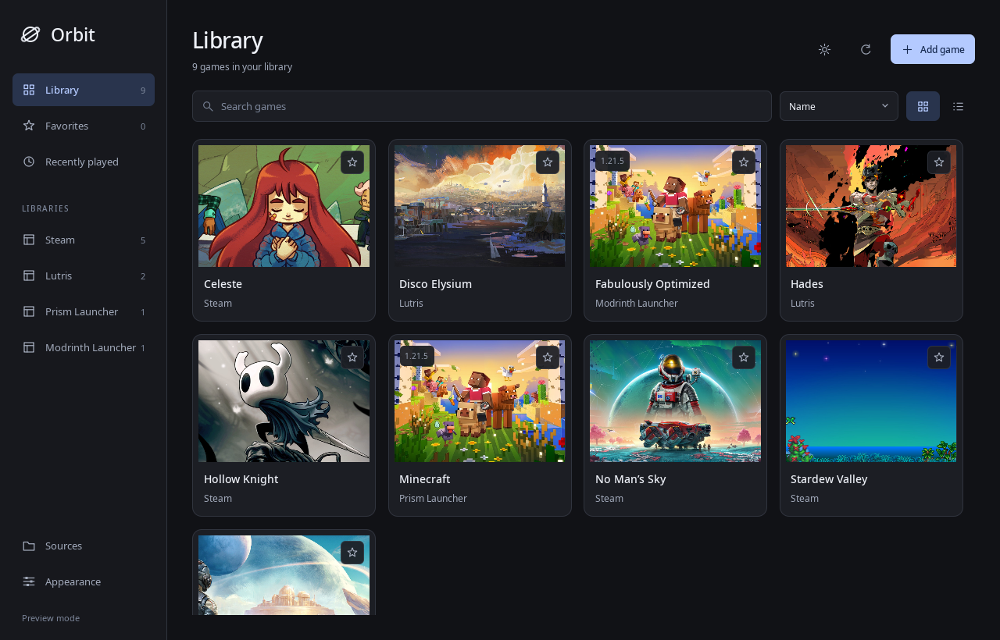
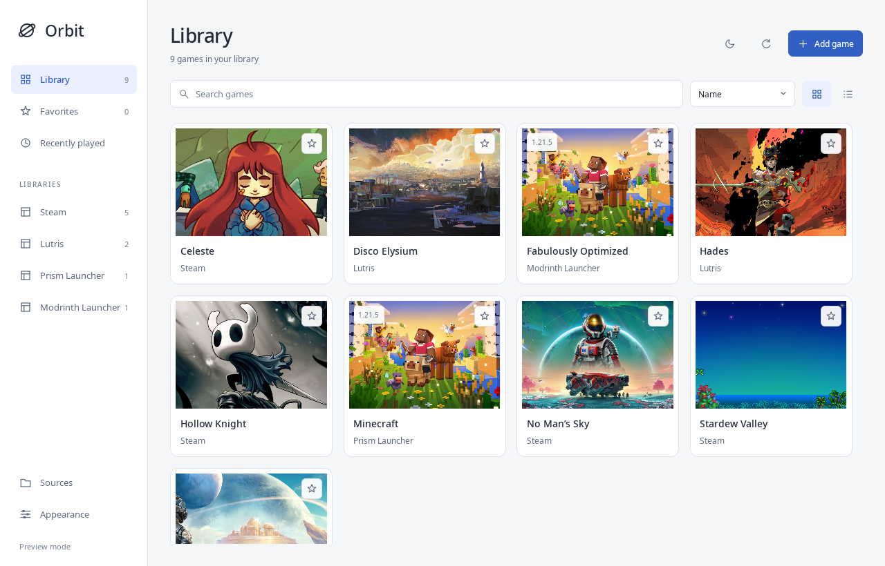

# Orbit

A local-first game and application launcher written in **Rust**, with a native **Qt 6 / KDE Kirigami** interface. Bring installed games into one searchable library, or add executables and JSON providers of your own.





## Platform support

| Source | Linux | Windows | Discovery and launching |
| --- | --- | --- | --- |
| Steam | Yes | Implemented | Installed manifests, extra libraries, cached covers; native/Flatpak on Linux, registry/executable discovery on Windows |
| Lutris | Yes | Unavailable | Installed games from the read-only database; native/Flatpak launching |
| Prism Launcher | Yes | Implemented | Instances, custom directories, Minecraft update covers; direct instance launch skips the main window |
| Modrinth Launcher | Yes | Implemented | Read-only legacy/current databases, custom data folders, installed instance versions; current instance launch links |
| Epic Games | Unavailable | Implemented | Installed `.item` manifests; Epic protocol launching, excluding incomplete installs, DLC and engine plugins |
| GOG Galaxy | Unavailable | Implemented | Registry game folders and `goggame-*.info`; Galaxy launching with game ID and path |
| Custom games/apps and JSON providers | Yes | Implemented | Executable, separate arguments, optional working folder and local artwork |

GitHub Actions builds the full GUI on **Linux x86_64, Windows x86_64, and macOS Intel/Apple Silicon**, runs core and offscreen UI checks, and uploads release binaries on every push and pull request. See [automated builds and downloads](docs/ci.md) for artifacts and runtime requirements. Native macOS game discovery is not implemented yet; custom games and JSON providers can be configured. Real Windows game launches and standalone deployment still need validation; follow the [Windows guide](docs/windows.md) and [detailed TODO](TODO.md).

## Run on Linux

On Arch Linux / CachyOS:

```sh
sudo pacman -S --needed rust base-devel qt6-base qt6-declarative kirigami
QMAKE=/usr/bin/qmake6 cargo run --locked
```

Qt 6.5+, development headers/tools, Kirigami 6 and a C++ toolchain are required. Other distributions need equivalent packages. CXX-Qt generates the Qt bridge at build time. Orbit draws interface icons itself, so a desktop icon theme is unnecessary. The relevant game launchers must be installed and configured to play their games.

```sh
cargo run --locked -- --demo         # Sample library; no launches or configuration writes
cargo run --locked -- --demo --light # Preview the light theme
cargo build --locked --release      # Binary: target/release/orbit
```

Set `QMAKE` to Qt 6's qmake executable for nonstandard installations. Use matching Qt and Kirigami libraries.

## Run on Windows

In an x64 MSVC developer environment with KDE Craft activated:

```powershell
.\scripts\build-windows.ps1 -QMake C:\CraftRoot\bin\qmake.exe
.\target\x86_64-pc-windows-msvc\release\orbit.exe --demo
```

Use your actual Craft path. `-Package` stages Qt/KDE dependencies and runs isolated interaction checks. See the [Windows guide](docs/windows.md) for prerequisites, paths and native release checks.

## Your library

Choose **dark or light mode**, switch between grid and list views, and adjust card size in Appearance. Search, source filters, favorites and recent launches keep the library easy to navigate. Covers load from installed launchers and a background artwork cache. Minecraft instances use artwork for their installed game drop or update. Small application icons stay sharp instead of being stretched across cards; missing images use a quiet initials placeholder. In game details, **Choose cover** sets a local image and **Reset** restores automatic selection. Appearance includes an offline artwork toggle and a choice to prefer Modrinth modpack galleries. See the [artwork guide](docs/artwork.md) for selection, caching and extension hints. Browse controls help configure sources and add a game or application. Invalid forms keep your input for correction.

The default library contains actual installed games. Sample entries appear only with `--demo`. Orbit does not download your account library or require credentials. A successful launch message confirms dispatch of the request; it does not confirm that the game reached its main menu.

Under **Sources**, enable integrations, add absolute paths, or set a launcher command override:

| Source | Additional path should point to |
| --- | --- |
| Steam | A folder containing `steamapps` |
| Lutris | Its data directory or `pga.db` |
| Prism | Its data directory containing `prismlauncher.cfg` and normally `instances` |
| Modrinth | Its application data directory containing `app.db`, or `app.db` itself; custom content folders are read from its settings |
| Epic | A manifest directory containing `.item` files |
| GOG | A game folder or library with `goggame-*.info` in immediate game folders |

Commands are JSON arrays, such as `["C:/Apps/PrismLauncher/prismlauncher.exe"]`, `["/opt/PrismLauncher.AppImage"]` or `["flatpak", "run", "org.prismlauncher.PrismLauncher"]`. Orbit appends game-specific arguments. Epic and current Modrinth instances normally use their registered URI handlers; a command override receives the URI as one argument.

Prism uses `--dir <data-folder> --launch <instance-id>` to start the instance while skipping its main window. Prism still handles authentication, Java and mod loaders, and may show account or error dialogs. Existing Prism settings control console windows and reopening after the game exits.

Modrinth discovery supports both legacy `profiles` and current `instances` databases, follows custom content folders, and skips unfinished or missing installations. Current builds launch via `modrinth://launch/instance/<id>`. Older builds lack direct instance launch support, so their entries show **Open launcher** and ask you to select the profile there. Configure a command override if your Linux desktop has no Modrinth URI handler.

Settings live in `$XDG_CONFIG_HOME/orbit/settings.json` (normally `~/.config/orbit/settings.json`) on Linux and `%APPDATA%\Orbit\settings.json` on Windows. `ORBIT_CONFIG_DIR` overrides the directory. Writes atomically replace the file. Legacy accent-based settings retain favorites, source paths and history, and default to dark mode. Malformed settings are reported and protected from automatic overwrite; correct the file or move it aside, then restart. `--light` selects and saves light mode unless used with `--demo`.

Keyboard shortcuts: **Ctrl+F** search, **Ctrl+R** refresh, **Ctrl+N** add, **Ctrl+,** appearance, **Escape** close dialogs / clear search.

## Extend Orbit

### JSON providers

Create a `providers` folder inside Orbit's configuration directory, add a manifest such as [`examples/local-games.json`](examples/local-games.json), and refresh. Sources can open this directory. Each provider appears in navigation and Sources and can be disabled. IDs must be unique ASCII letters, digits or hyphens; `steam`, `lutris`, `prism`, `modrinth`, `epic`, `gog` and `custom` are reserved. Game IDs are namespaced automatically.

```json
{
  "id": "native",
  "name": "Native games",
  "games": [{
    "id": "supertuxkart",
    "title": "SuperTuxKart",
    "provider": "native",
    "subtitle": "Open-source kart racing",
    "artwork": "",
    "command": ["supertuxkart"],
    "directory": null
  }]
}
```

`artwork` accepts a local `file:///...` URL or HTTPS image URL downloaded through Orbit’s cache. Optional `art` hints describe icons, remote covers, Minecraft versions and Modrinth projects; see the [artwork guide](docs/artwork.md). `directory` sets the working folder. Arguments pass directly without shell evaluation. Reading a manifest does not execute it; pressing Play does. Optional `launch_uri` takes precedence over `command` and accepts Epic game-launch links on Windows or Modrinth instance-launch links on Linux/Windows. Install and authentication links are rejected. Most extensions should use `command`.

### Rust providers

Implement `Provider` in `src/providers/`, returning `Game` records, discovery errors and platform availability. Register it in `providers::discover`; stable IDs preserve favorites and history. Discovery runs on a worker thread and publishes results on the GUI thread. `model`, `store`, `platform`, `providers` and `artwork` work independently of Qt with `--no-default-features`.

QML owns presentation; [`qml/Theme.qml`](qml/Theme.qml) defines semantic colors and [`src/bridge.rs`](src/bridge.rs) exposes Rust operations through CXX-Qt.

## Linux desktop installation

After a release build:

```sh
install -Dm755 target/release/orbit ~/.local/bin/orbit
install -Dm644 packaging/app.orbit.Launcher.svg ~/.local/share/icons/hicolor/scalable/apps/app.orbit.Launcher.svg
install -Dm644 packaging/app.orbit.Launcher.desktop ~/.local/share/applications/app.orbit.Launcher.desktop
```

Ensure `~/.local/bin` is on the desktop session's `PATH`, or use its absolute path in the desktop file's `Exec` entry.

## Validation

```sh
cargo fmt --check
cargo clippy --locked --all-targets -- -D warnings
cargo test --locked --no-default-features
QMAKE=/usr/bin/qmake6 cargo build --locked
scripts/check-ui.sh
QT_QPA_PLATFORM=offscreen QT_QUICK_BACKEND=software target/debug/orbit --demo --smoke-test
```

Rust tests cover Steam libraries and escaped Windows paths, read-only Lutris queries, custom Prism directories, Epic/GOG fixtures, both Modrinth schemas, direct launch arguments, artwork selection/cache/offline behavior, Minecraft version matching, extensions, protocols, metadata migration and repeated settings replacement. Windows CI also exercises a temporary test-owned registry key. UI checks cover both palettes, search, favorites, filters, views, dialogs, custom games, validation, compact navigation, image/icon error fallbacks, artwork preferences and demo isolation.

The smoke test loads the Kirigami window and exits automatically. Add `--screenshot /absolute/path/preview.png` to capture the rendered page, or `--light` for its light theme. On Windows, run `scripts/check-ui.ps1 -Executable <path-to-orbit.exe>` after building. See [TODO.md](TODO.md) for native Windows, accessibility and packaging work.

MIT licensed; see [LICENSE](LICENSE).
